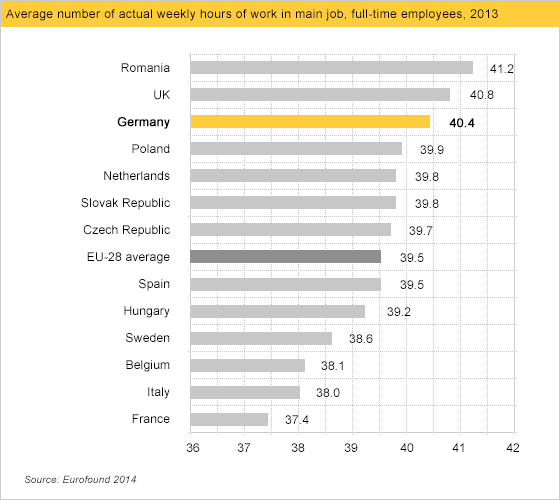
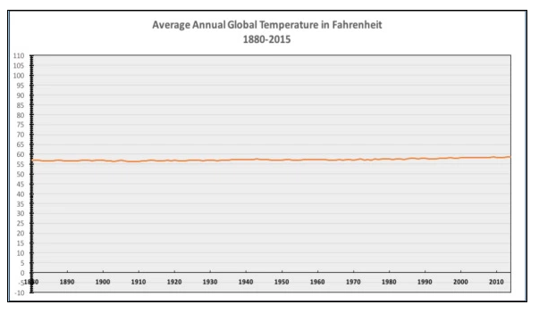
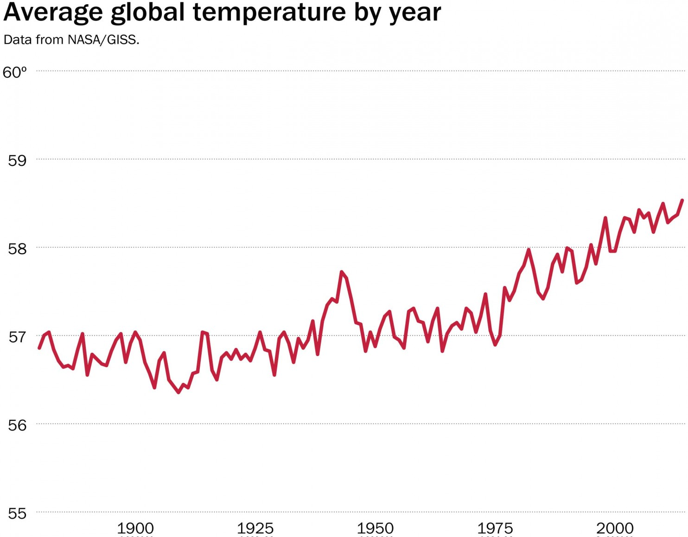

```{r setup, include=FALSE}
library(knitr)
knitr::opts_chunk$set(echo = TRUE, out.width = "55%", warning = FALSE)
```

## Why vizualize data?
1. To explore relationships in our data
2. To communicate/present what we found

```{r  out.width = "70%", echo = FALSE, fig.align='center'}
include_graphics("figs/nightengale.jpg")
```

## Why ggplot?
- Easy to quickly generate plots which can help us do # 1
- Flexible and good defaults which help us with # 2

## Packages we need
```{r cars, echo = TRUE}
# install.packages("ggplot2")
# install.packages("tidyverse")
remotes::install_github("allisonhorst/palmerpenguins")
library(ggplot2)
library(palmerpenguins)
```

## The basics of the ggplot = the dataframe
- A new classic data set: the Palmer Penguins!

```{r  out.width = "50%", echo = FALSE, fig.align='center'}
include_graphics("figs/lter_penguins.png")
```
[_*Artwork by @allison_horst*_](https://github.com/allisonhorst/palmerpenguins)

## The basics of the ggplot = the dataframe

*Note: I originally used the `iris` dataset, published by Ronald Fisher in the Annals of Eugenics in 1936. While the data themselves pertain to flowers, we cannot strip this data of it's context, And given the joyous alternative of penguins and many others (use `data()` to check out all the other datasets available that are not `iris`), this is an easy thing to do.* 

```{r}
data()
```

## The basics of the ggplot = the dataframe
- A dataframe where each row corresponds to a record ('wide format') and variables are columns
```{r}
ggplot(data = penguins)
```
  
  **Creates a blank plot. We need to decide what variables we want to plot.**

## The basics of the ggplot = the aes
- aes = the aesthetics.
```{r}
head(penguins)
```
  
  **Let's look at the relationship between the variables `bill_length_mm` and `bill_depth_mm`.**

## The basics of the ggplot = the aes
- aes = the aesthetics (what we want to plot)
```{r}
## Let's try the bill_length_mm vs. the bill_depth_mm (x, y plot)
ggplot(data = penguins, aes(x = bill_length_mm, y = bill_depth_mm)) 
```
  
  **Still blank! We need to decide what kind of plot to use.**

## How do we figure out what kind of plot to use?
**We need to think about how best to visualize this data.**
```{r}
summary(penguins)
```

## How do we figure out what kind of plot to use?
**We need to think about what we want to show.**

Quick excercise: try drawing with pen and paper what you think these plots might look like: 
  
  
- Relationship between `bill_length_mm` and `bill_depth_mm`
- Distribution of `bill_length_mm`
- Comparing the means of `bill_length_mm` by `species`

## How do we figure out what kind of plot to use?
**We need to think about what we want to show.**

Quick excercise: try drawing with pen and paper what you think these plots might look like:
  
  
- Relationship between `bill_length_mm` and `bill_depth_mm`
- Distribution of `bill_length_mm`
- Comparing the means of `bill_length_mm` by `species`

**Hint** 
Here are the options: Histogram - XY Scatter plot - Boxplot.

## The basics of ggplot = the geom
- Geom = geometry 
  
- The 'geom_' functions choose what kind of graph we want to show:
  - **geom_point (point graphs, xy relationships)**
  - **geom_histogram (distribution of a continuous variable)**
  - **geom_boxplot (comparing means of groups)**
  - geom_col/geom_bar
  - geom_line (timeseries)
  - geom_tile (heatmaps)
  - geom_polygon/geom_sf() (mapping)


## geom_point: XY Relationship
```{r}
## add the geom that we want
ggplot(data = penguins, aes(x = bill_length_mm, y = bill_depth_mm)) +
  geom_point()
```
  
**Is there anything you notice?**

## Adding other aesthetics to help visualize potential relationships
**Using color, we want to differentiate the points by species.**
```{r}
## 
ggplot(data = penguins, aes(x = bill_length_mm, y = bill_depth_mm, color = species)) +
  geom_point()
```
  
## Adding other aesthetics to help visualize potential relationships
- The common aesthetics you can add:
  - color 
  - fill 
  - shape
  - linewidth
  - alpha (transparency)

## Adding other aesthetics to help visualize potential relationships
**Now try it with shape and fill.**
```{r}
## 
ggplot(data = penguins, aes(x = bill_length_mm, y = bill_depth_mm, shape = species)) +
  geom_point()
```
  
  **Need to trouble shoot a bit to see what the best option is for a given geom.**

## Specifying things within vs. outside the aes
- Outside aes
```{r}
## try it outside
ggplot(penguins, aes(x = bill_length_mm, y = bill_depth_mm), color = species) +
  geom_point()
```

## Specifying things within vs. outside the aes
- As part of geom
```{r}
## add it to the geom 
ggplot(penguins, aes(x = bill_length_mm, y = bill_depth_mm)) +
  geom_point(color = "red")

```

## Specifying things within vs. outside the aes
- Inside aes = the way to specify an aesthetic by a variable in the dataframe.
```{r}
## 
ggplot(penguins, aes(x = bill_length_mm, y = bill_depth_mm, color = species)) +
  geom_point()
```
  
  **Try playing around with the aesthetics and see what you get!**

## Going a bit further: comparing means
```{r}
## 
ggplot(data = penguins, aes(x = species, y = bill_depth_mm)) +
  geom_boxplot()
```
  
  - boxplots visualize the mean (in ggplot, also the 25 and 75% quantiles and any points outside of those--considered outliers)

##  Going a bit further: distributions
```{r}
## The histogram
ggplot(data = penguins, aes(x = bill_depth_mm)) +
  geom_histogram()
```
  
**Play around with the binwidth option to see what the best bin is**. 

##  Going a bit further: distributions by categorical variable
```{r}
## The histogram
ggplot(data = penguins, aes(x = bill_depth_mm, fill = species)) +
    geom_histogram(binwidth = 0.25)
```

##  Going a bit further: distributions by categorical variable
```{r}
## The density plot
ggplot(data = penguins, aes(x = bill_depth_mm, fill = species)) +
  geom_density()
```

## Going a bit further: creating multiple plots with facetting
- If we want to split this plot by species to make it easier to see the distributions
```{r}
## By fill
ggplot(data = penguins, aes(x = bill_depth_mm, fill = species)) +
  geom_histogram(binwidth = 0.25)
```

## Going a bit further: creating multiple plots with facetting
```{r}
## By facetting
ggplot(data = penguins, aes(x = bill_depth_mm)) +
  geom_histogram(binwidth = 0.25) +
  facet_wrap(~ species)
```

## Customizing our ggplot
- We'll save our ggplot as an object called base.
  
```{r}
base <- ggplot(data = penguins, aes(x = species, y = bill_depth_mm, color = species)) +
  geom_boxplot()
```

## Customizing: labels
- Then we can change specific components of it by adding customizations. 
  
```{r}
base +
  xlab("Species") +
  ylab("Bill Depth")
```

## Customizing: color scales
```{r}
base +
  xlab("Species") +
  ylab("Bill depth") +
  scale_color_manual(values = c("purple", "blue", "lightblue"), name = "Species of Penguin")
```

## Customizing: color scales
  - The scale_ functions help us specify what colors we want to use
    - scale_fill_gradient
    - scale_fill_continuous
  - The viridis color scales are a good option to try for continuous variables! (scale_fill_viridis)
  
## Customizing: themes
```{r}
base +
  theme_bw()
```
  
  **Try theme_dark and theme_classic.**

## Saving our plots
```{r}
base <-  ggplot(data = penguins, aes(x = species, y = bill_depth_mm, color = species)) +
  geom_boxplot() + 
  xlab("Species") +
  ylab("Bill depth") +
  scale_color_manual(values = c("purple", "blue", "lightblue"), name = "Species of Penguin") +
  theme_bw()

ggsave("base_plot.pdf", base, device = "pdf")
```

## Customizing...the options are almost unlimited!
- For most of the routine things you need to do, there is a way. To figure it out your best friend is stack exchange and the ggplot documentation!

## Other considerations: communicating accurately and effectively
- Anscombe's quartet
  - Identical means, variance, and correlation, but when you plot it you see the differences.
```{r  out.width = "50%", echo = FALSE, fig.align='left'}
include_graphics("figs/anscombe.png")
```

## Other considerations: communicating accurately and effectively
- Scales of axes: should they include zero?
```{r  out.width = "50%", echo = FALSE, fig.align='left'}

```

## Other considerations: communicating accurately and effectively
- Scales of axes: should they include zero?
```{r  out.width = "50%", echo = FALSE, fig.align='left'}
include_graphics("figs/axes_woutzero.png")
```

## Other considerations: communicating accurately and effectively
- Scales of axes: should they include zero?
```{r  out.width = "50%", echo = FALSE, fig.align='left'}

```

## Other considerations: communicating accurately and effectively
- Scales of axes: should they include zero?
```{r  out.width = "50%", echo = FALSE, fig.align='left'}

```

## Exercises
- Using the RxP data, plot:
  - The distribution of Snout-vent length at emergence (SVL.initial)
  - The correlation between Snout-vent length at emergence and at the end of the experiment (SVL.initial and SVL.final)
  - The mean of SVL.final by Res 
  - The mean of SVL.final by Pred
  - Advanced: the mean difference between final and initial SVL for Res and Pred

## How would you plot your own data?

## More resources
- General data vizualization: https://flowingdata.com
- Vizualizing data with ggplot2: http://socviz.co
- ggplot cheatsheet: https://www.rstudio.com/wp-content/uploads/2015/03/ggplot2-cheatsheet.pdf
- data carpentry course: https://datacarpentry.org/R-ecology-lesson/04-visualization-ggplot2.html
- stack exchange: https://stackoverflow.com/questions/tagged/ggplot2
- ggplot documentation: https://ggplot2.tidyverse.org

## References for images
- [Anscombe's Quartet from Chapter 1 in *Data Vizualization: a practical introduction*](https://socviz.co/lookatdata.html)
- [Florence Nightengale's Polar-Area Diagram](https://www.agnesscott.edu/lriddle/women/nightpiechart.htm)
- [Figures on misleading axes](https://callingbullshit.org/tools/tools_misleading_axes.html)
- [Palmer Penguins by Allison Horst](https://github.com/allisonhorst/palmerpenguins)
